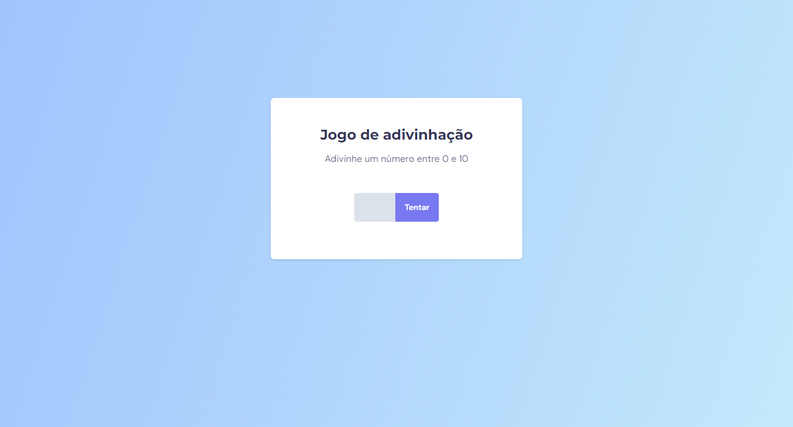
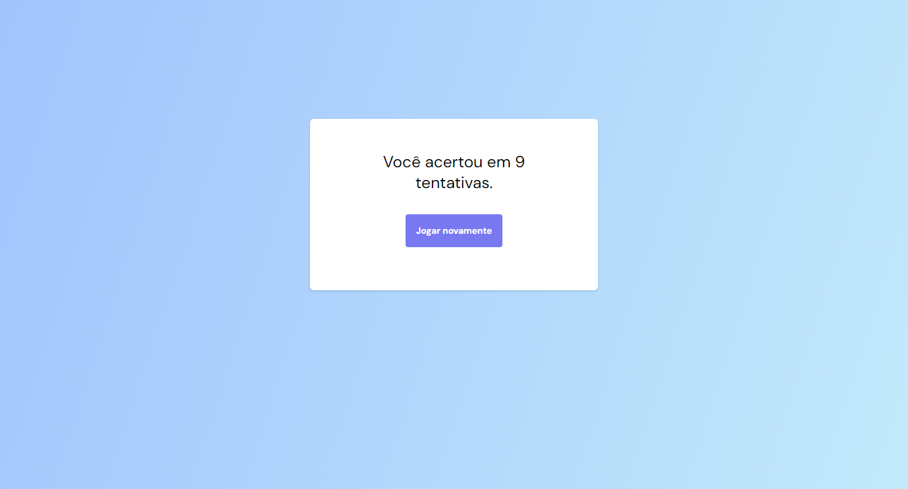

<h1 align="center">Projeto Jogo de Adivinhação</h1>

  <a href="#-preview">Preview</a>&nbsp;&nbsp;&nbsp;|&nbsp;&nbsp;&nbsp;
  <a href="#-tecnologias">Tecnologias</a>&nbsp;&nbsp;&nbsp;|&nbsp;&nbsp;&nbsp;
  <a href="#-projeto">Projeto</a>&nbsp;&nbsp;&nbsp;|&nbsp;&nbsp;&nbsp;
  <a href="#-layout">Layout</a>

 

## 🖥 Preview

Tela 1

Tela 2

## 🚀 Tecnologias

Esse projeto foi desenvolvido com as seguintes tecnologias:

- HTML e CSS
- Git e Github
- Figma

## 💻 Projeto

O projeto Jogo de Adivinhação consiste em uma tela ao qual o jogador deve informar um número de 0 a 10, e tentar acertar o número do correto no menor número de tentativas possível.
Desenvolvido com HTML, CSS e JavaScript.

## 🔖 Layout

Você pode visualizar o layout do projeto através [DESSE LINK](https://www.figma.com/design/0Nx9ADfqGq7alN4wYyItif/Jogo-Adivinha%C3%A7%C3%A3o-(Copy)?m=auto&t=MuvjJQEIuH421jYg-6), no Figma. 
designed by Rocketseat